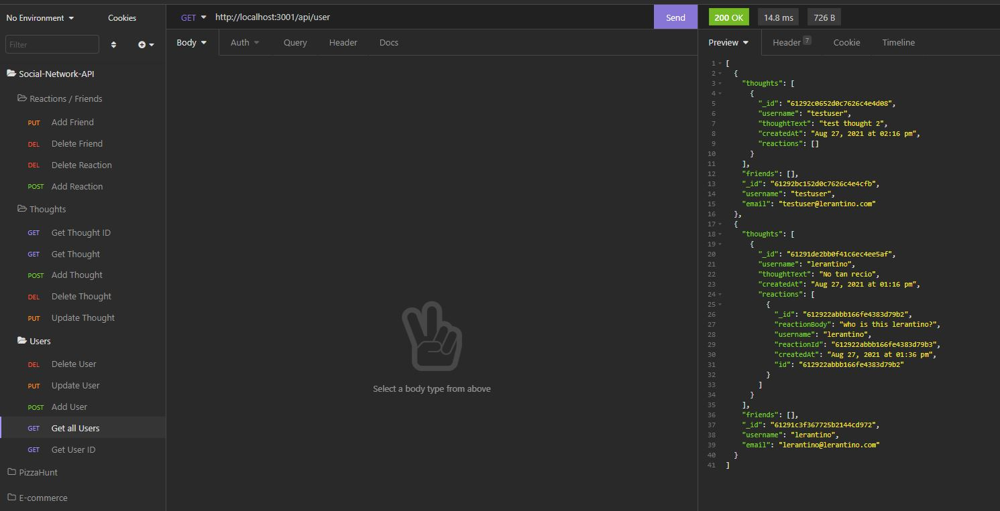

<!-- PROJECT TITE -->
  <h1 align="center">Social-Network-API</h1>
  
  <!-- DESCRIPTION -->
  

  An API for a social network web application where users can share their thoughts, react to friends’ thoughts, and create a friend list.

  <!-- DEPLOYED LINK -->
  Video: https://drive.google.com/file/d/1kUIa8zMYOgujomH9Xhidn6pM7dsB3EZ0/view
   
  GitHub repository URL: https://github.com/SaidHadad/Social-Network-API

  <!-- TABLE OF CONTENTS -->
  

  
Table of Contents

  <ol>
  <li><a href="#about-the-project">About The Project</a></li>
  <li><a href="#built-with">Built With</a></li>
  <li>
    <a href="#getting-started">Getting Started</a>
    <ul>
    <li><a href="#prerequisites">Prerequisites</a></li>
    <li><a href="#installation">Installation</a></li>
    </ul>
    </li>
  <li><a href="#contributing">Contributing</a></li>
  <li><a href="#license">License</a></li>
  <li><a href="#contact">Contact</a></li>
  </ol>
  

  
  
  <!-- ABOUT THE PROJECT -->
  ## About The Project

    
  14th Challenge for the University of Toronto Coding Bootcamp
  
  ## Built With

  * JavaScript
  * Node.js
  * MongoDB
  * Mongoose
  * Express.js
  
  <!-- GETTING STARTED -->
  
  ## Getting Started

  ### Prerequisites

  * MongoDB
  * REST API Client

  ### Installation
  Get the repository and run "npm install --y". Once that is done you can run "npm start" to connect to the server and navigate through the API routes with your prefered API client.

  <!-- CONTRIBUTING -->
    
  <!-- LICENSE -->
  
  ## License

 

[MIT License](https://choosealicense.com/licenses/mit/)  
  
  <!-- CONTACT -->
  
  ## Contact
  Name: Said David Hadad  
  Email: saiddavid.hadad@gmail.com  
  GIT: https://github.com/SaidHadad  